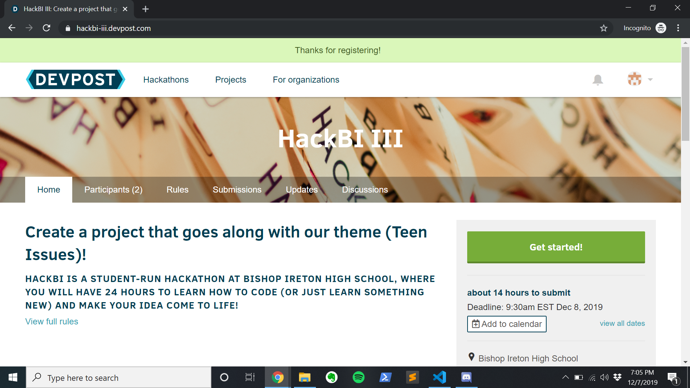

# DevpostGuide
The guide for submitting to HackBI III!

## Register
To start, head over to Devpost and search for HackBI (or go to https://hackbi-iii.devpost.com/)

Go ahead and click on "Register for this hackathon". If you don't already have an account, it will prompt you to make one.

Once you're there, you can answer the questions on the register page.

## Start your submission
After you've registered for the hackathon on Devpost, you'll be on this page:

where you can click on "Get Started" to start your submisison. You'll be taken to this page:

On this page, you can either import your project from GitHub (the much preferred option, check out the workshop at https://github.com/HackBI/GitHubWorkshop), or you can just start your submission manually. After completing the captcha and pressing Save and Continue, you'll see this screen:

where you can give some basic project info and add your teammates by email. They need to register for HackBI themselves, but don't need to create their own projects - this will allow them to join yours.

Fill out the rest of the info on this page. Make SURE to, on this page or the next, give your table and room number that you'll be presenting from.

Finally, go ahead and "complete" your submission - you can go back and edit later with the green button on the right.

